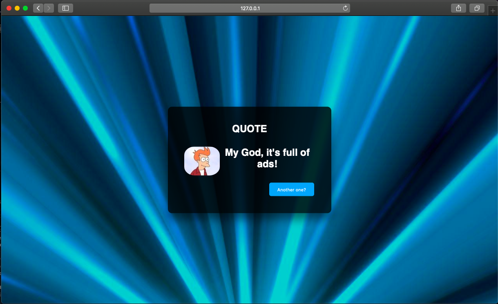
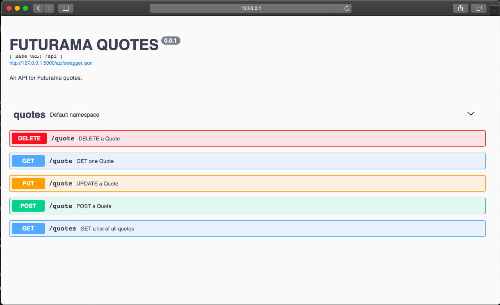

# futurama_quote_machine

A Flask App that returns Futurama quotes

### Get it

Clone the repo

    git clone https://gitlab.com/deafmice/futurama_quote_machine.git

Setup you virtualenv and activate it

    virtualenv -p python3 venv
    source venv/bin/activate

Install requirements

    pip install -r requirements.txt

*[Note: See an example .env file below]*

    source .env

Run Flask app

    flask run

Open http://127.0.0.1:5000

Enjoy a nice quote!

### Setup DB and inset quotes

Create the DB and tables

    python db_model.py

Populate the DB with quotes

    python get_quotes.py

### API

Basic CRUD routes setup in the API

http://127.0.0.1:5000/api

#### App Screenshot

#### API Screenshot

#### Example .env file

    # Basic Flask stuff
    export FLASK_APP=run.py
    export FLASK_CONFIG=development

